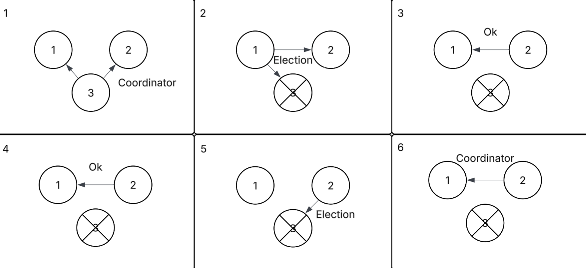

# Checkpoint 2
### System Model:

The system follows a microservices-based architecture, with each component assigned a well-defined role. The Frontend functions as the user interface, allowing users to place orders. These orders are then forwarded to the Orchestrator, which serves as the central coordinator responsible for managing other microservices.

First, the Frontend sends the order information to the Orchestrator. The Orchestrator then distributes the necessary information to the appropriate services. Once initial setup is complete, it triggers the Transaction Verification and Fraud detection services. Upon successful verification, the Orchestrator lets the Order Queue service place the order into a queue, from where the executors dequeue the orders and execute them. At the same time, the Suggestions service generates suggestions for books based on the order.

The architecture supports partially asynchronous communication, allowing services to function independently and avoiding bottlenecks. Also, the verification of orders employs vector clocks to ensure a predictible outcome

Only the Executor components are designed to fail. In the event of an Executor failure, the remaining Executors automatically start a leader selection, to determine the new leader, so that the system can continue processing the remaining orders from the queue. This ensures system reliability and continuous operation.

### Vector clock diagram

### Leader election diagram

